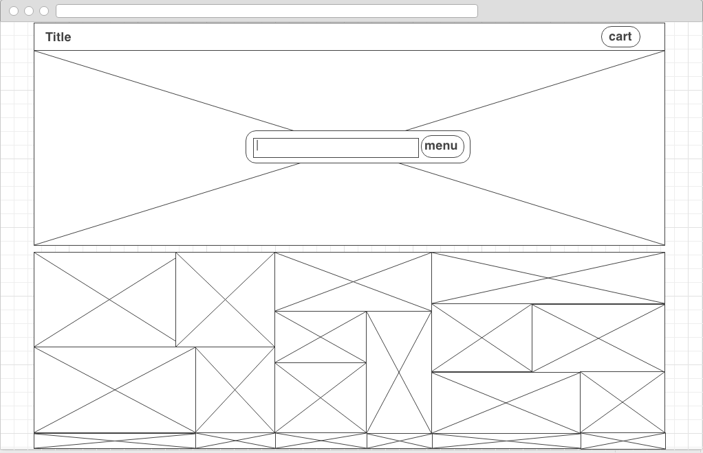
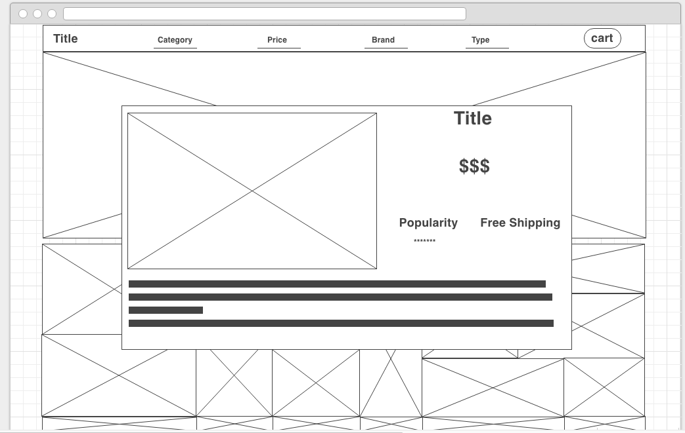
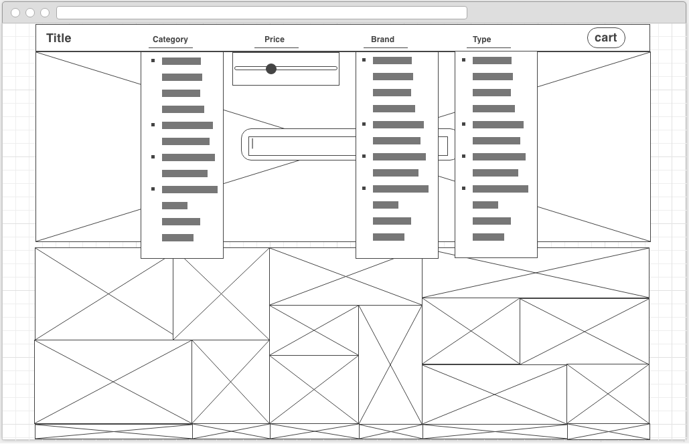

#<center> Algolia Tech Shop </center> 

##Objective
This repository houses an example of an Algolia-based auto-completion menu for a genertic e-commerce tech goods site.

##Access the Site
A complete version of this site has been deployed and can be viewed on this [gh-pages](http://ariflo.github.io/algoliaTechShop/) address.

##Download Locally with Node.js
If you have the latest versions of [git](https://git-scm.com/book/en/v2/Getting-Started-Installing-Git) and [Node](https://nodejs.org/en/) (if on a mac you will also need [x-code](https://developer.apple.com/xcode/downloads/) ) installed on your local enviorment you can setup a copy this site by pasting the following into your terminal's command line: 

```
git clone https://github.com/Ariflo/algoliaTechShop/
```

Once you've got a local copy enter this into your command line to install the dependencies:

```
npm install --save--dev
```

Then launch the site locally with gulp:

```
npm run gulp --build-dev
```


Wire Frame Layouts
-
**Homepage**



**Item Modal**



**Menu**
    



 